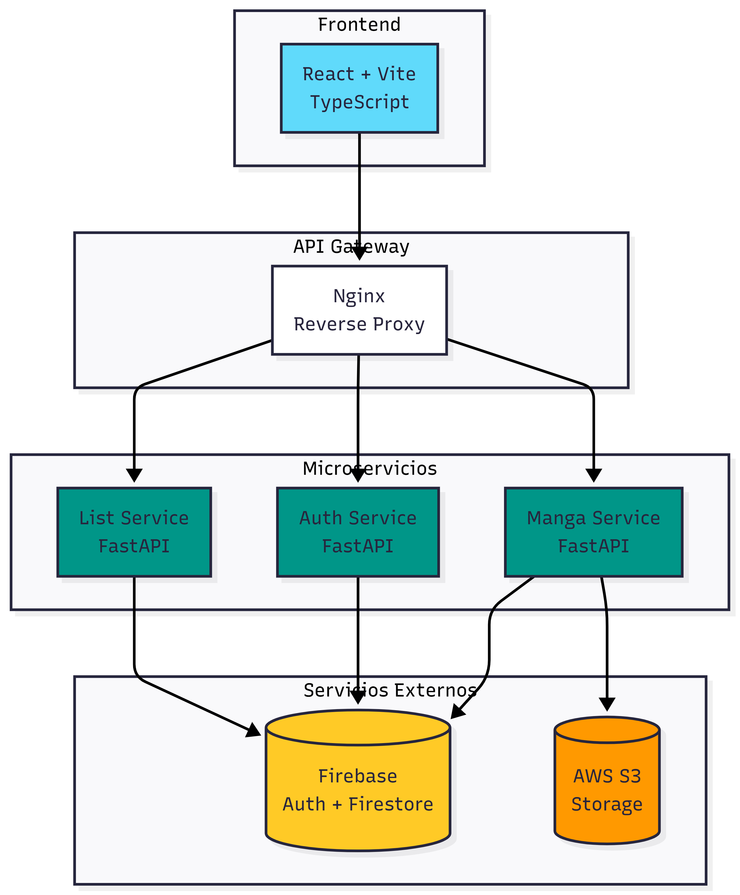
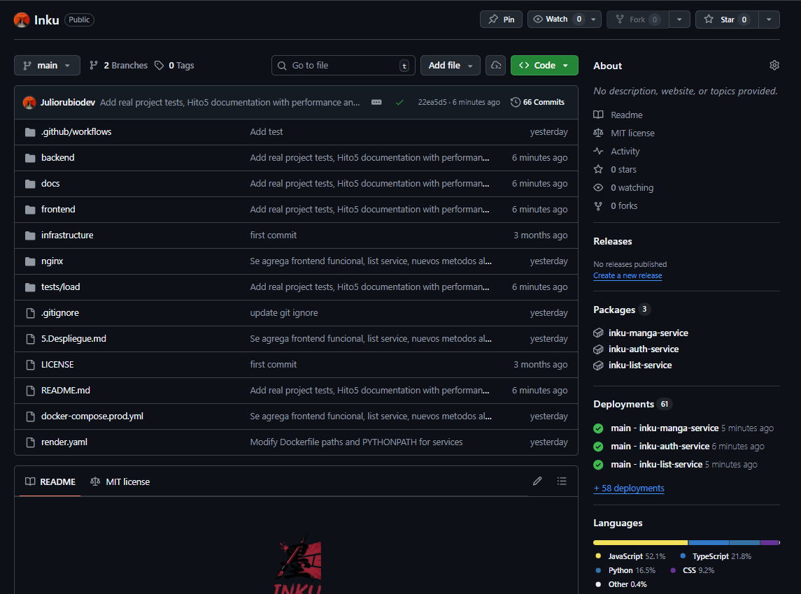
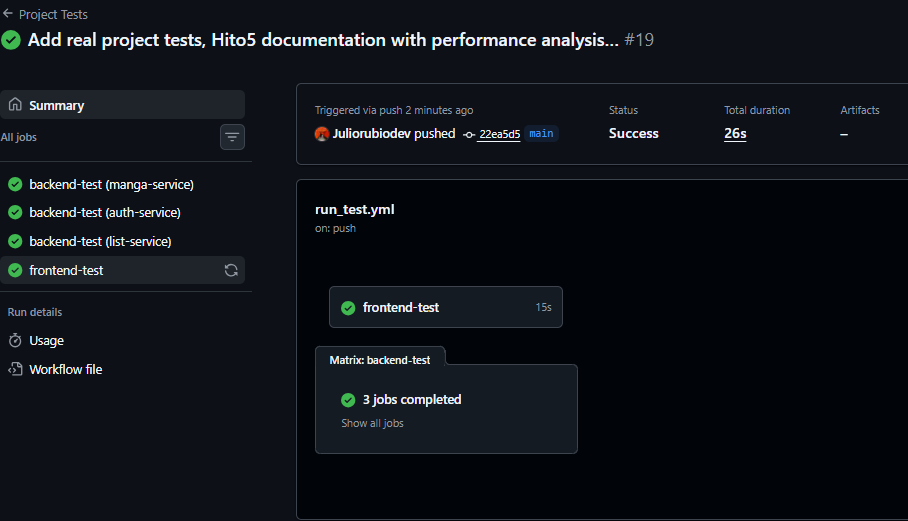
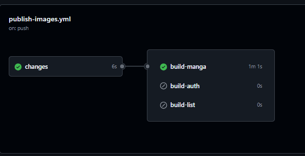
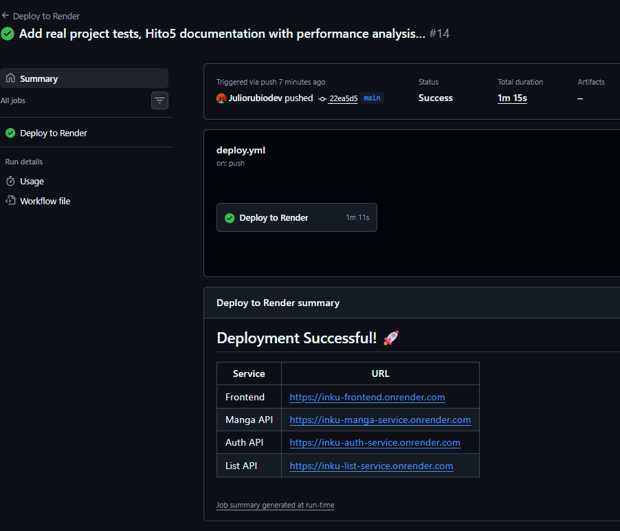

<p align="center">
  
</p>

<h1 align="center">🏯 Inku - Plataforma de Lectura de Manga</h1>

<p align="center">
  
  
  
  
  
  
</p>

<p align="center">
  <a href="https://inku-frontend.onrender.com">🌐 Ver Demo en Vivo</a> •
  <a href="#-características">Características</a> •
  <a href="#-arquitectura">Arquitectura</a> •
  <a href="#-instalación">Instalación</a> •
  <a href="#-documentación">Documentación</a>
</p>

---

## 📖 Descripción

**Inku** (墨 - "tinta" en japonés) es una plataforma moderna, escalable y de alto rendimiento para la lectura y gestión de mangas. Construida con una arquitectura de microservicios, permite a los usuarios explorar un catálogo de mangas, leer capítulos en formato PDF, crear listas personalizadas y gestionar su biblioteca personal.

El proyecto implementa las mejores prácticas de desarrollo de software moderno, incluyendo:
- ✅ Arquitectura de microservicios desacoplados
- ✅ Contenedorización con Docker
- ✅ CI/CD con GitHub Actions
- ✅ Despliegue automático en la nube (Render)
- ✅ Autenticación segura con Firebase
- ✅ Almacenamiento escalable con AWS S3
- ✅ Testing automatizado

---

## 🌟 Características

### Para Usuarios
| Característica | Descripción |
|----------------|-------------|
| 📚 **Catálogo de Mangas** | Exploración con búsqueda, filtros por tags y recomendaciones |
| 📖 **Lector PDF Integrado** | Visor optimizado para lectura de capítulos |
| 📝 **Listas Personalizadas** | Crea y gestiona colecciones públicas o privadas |
| 🔐 **Autenticación Segura** | Login con Google/Email vía Firebase Auth |
| ⭐ **Sistema de Favoritos** | Marca mangas y organiza tu biblioteca |

### Para Administradores
| Característica | Descripción |
|----------------|-------------|
| ⬆️ **Subida de Contenido** | Upload de mangas y capítulos con portadas |
| ☁️ **Almacenamiento S3** | PDFs y imágenes en AWS S3 con URLs presignadas |
| 🏷️ **Gestión de Tags** | Categorización y etiquetado de contenido |
| 📊 **Panel de Control** | Administración centralizada |

---

## 🏗️ Arquitectura

### Diagrama de Arquitectura



### Descripción de Servicios

| Servicio | Puerto | Descripción | Tecnologías |
|----------|--------|-------------|-------------|
| **Frontend** | 5173 | Aplicación web SPA | React 19, Vite, TypeScript |
| **Manga Service** | 8001 | API de catálogo y contenido | FastAPI, Firebase, AWS S3 |
| **Auth Service** | 8002 | Autenticación y usuarios | FastAPI, Firebase Auth |
| **List Service** | 8003 | Gestión de listas | FastAPI, Firestore |
| **Nginx** | 80 | API Gateway | Nginx |

---

## 🛠️ Stack Tecnológico

### Frontend
```
├── React 19.2          # UI Library
├── Vite 7.2           # Build Tool & Dev Server
├── TypeScript 5.9     # Type Safety
├── React Router 7     # Client-side Routing
├── Axios              # HTTP Client
├── Firebase SDK       # Authentication
└── Vitest             # Testing Framework
```

### Backend
```
├── Python 3.11        # Runtime
├── FastAPI 0.122      # Web Framework
├── Uvicorn            # ASGI Server
├── Pydantic 2.x       # Data Validation
├── Firebase Admin     # Auth & Firestore
├── Boto3              # AWS SDK (S3)
└── Pytest             # Testing Framework
```

### Infraestructura
```
├── Docker             # Containerization
├── Docker Compose     # Local Orchestration
├── Nginx              # Reverse Proxy
├── Render             # Cloud PaaS
├── GitHub Actions     # CI/CD
└── GitHub Packages    # Container Registry
```

---

## 📁 Estructura del Proyecto

```
Inku/
├── 📂 backend/                     # Microservicios Python
│   ├── 📂 manga-service/           # Gestión de mangas y capítulos
│   │   ├── src/inku_api/
│   │   │   ├── domain.py           # Modelos de dominio (Manga, Chapter)
│   │   │   ├── routers/            # Endpoints API
│   │   │   ├── services/           # Lógica de negocio
│   │   │   └── adapters/           # Repositorios (Firestore, S3)
│   │   ├── tests/                  # Tests unitarios
│   │   ├── Dockerfile              # Container local
│   │   └── Dockerfile.render       # Container producción
│   │
│   ├── 📂 auth-service/            # Autenticación
│   │   ├── app/
│   │   │   ├── main.py
│   │   │   ├── routers/auth.py
│   │   │   └── core/config.py
│   │   └── tests/
│   │
│   ├── 📂 list-service/            # Listas de usuarios
│   │   ├── src/list_service/
│   │   │   ├── main.py
│   │   │   ├── models.py           # Modelos Pydantic
│   │   │   └── repository.py       # Firestore Repository
│   │   └── tests/
│   │
│   ├── 📂 shared/                  # Código compartido
│   │   └── auth.py                 # Firebase auth utilities
│   │
│   └── docker-compose.yml          # Orquestación local
│
├── 📂 frontend/                    # Aplicación React
│   ├── src/
│   │   ├── components/             # Componentes reutilizables
│   │   ├── pages/                  # Páginas de la aplicación
│   │   ├── lib/                    # API clients, Firebase config
│   │   ├── types/                  # TypeScript interfaces
│   │   └── __tests__/              # Tests de frontend
│   ├── vite.config.ts
│   └── vitest.config.ts
│
├── 📂 nginx/                       # API Gateway
│   └── nginx.conf
│
├── 📂 docs/                        # Documentación
│   ├── documentacion_hitos/
│   │   ├── Hito4.md
│   │   └── Hito5.md
│   └── assets/
│
├── 📂 .github/workflows/           # CI/CD Pipelines
│   ├── run_test.yml                # Tests automatizados
│   ├── publish-images.yml          # Build & Push Docker images
│   └── deploy.yml                  # Deploy to Render
│
├── render.yaml                     # Render Blueprint (IaC)
├── docker-compose.prod.yml         # Producción local
└── README.md
```

---

## 🚀 Instalación

### Prerrequisitos
- Node.js 20+
- Python 3.11+
- Docker y Docker Compose
- Cuenta de Firebase (con Firestore habilitado)
- Cuenta de AWS (para S3)

### Desarrollo Local con Docker Compose

```bash
# 1. Clonar el repositorio
git clone https://github.com/Juliorubiodev/Inku.git
cd Inku

# 2. Configurar variables de entorno
cp backend/.env.example backend/.env
# Editar .env con tus credenciales de Firebase y AWS

# 3. Levantar todos los servicios
cd backend
docker-compose up --build

# 4. En otra terminal, iniciar el frontend
cd frontend
npm install
npm run dev
```

### URLs Locales
| Servicio | URL |
|----------|-----|
| Frontend | http://localhost:5173 |
| Manga API | http://localhost:8001/api |
| Auth API | http://localhost:8002/api |
| List API | http://localhost:8003/api |
| Nginx Gateway | http://localhost:80 |

---

## ☁️ Despliegue en Producción

El proyecto está desplegado en **Render** usando Infrastructure as Code (IaC) con el archivo `render.yaml`.

### URLs de Producción

| Servicio | URL |
|----------|-----|
| 🌐 **Frontend** | https://inku-frontend.onrender.com |
| 📚 **Manga API** | https://inku-manga-service.onrender.com |
| 🔐 **Auth API** | https://inku-auth-service.onrender.com |
| 📝 **List API** | https://inku-list-service.onrender.com |

### Despliegue Automático

El proyecto usa CI/CD con GitHub Actions:
1. **Push a `main`** → Ejecuta tests
2. **Tests pasan** → Build de imágenes Docker
3. **Imágenes publicadas** → Deploy automático a Render

---

## 🧪 Testing

### Ejecutar Tests Localmente

```bash
# Backend - Manga Service
cd backend/manga-service
pip install -r requirements.txt
pytest tests/ -v

# Backend - Auth Service
cd backend/auth-service
pip install -r requirements.txt
pytest tests/ -v

# Backend - List Service
cd backend/list-service
pip install -r requirements.txt
pytest tests/ -v

# Frontend
cd frontend
npm install
npm test
```

### Tests Incluidos

| Servicio | Tests | Descripción |
|----------|-------|-------------|
| manga-service | 15+ | Modelos de dominio, validadores, FastAPI |
| auth-service | 5+ | Health checks, configuración |
| list-service | 5+ | Health checks, endpoints públicos |
| frontend | 20+ | Types, componentes, async |

---

## 📚 Documentación

| Documento | Descripción |
|-----------|-------------|
| [📘 Hito 4: Composición de Servicios](docs/documentacion_hitos/Hito4.md) | Docker Compose, orquestación |
| [📗 Hito 5: Despliegue en la Nube](docs/documentacion_hitos/Hito5.md) | Render, CI/CD, observabilidad |
| [📙 Manual de Despliegue Render](docs/MANUAL_DESPLIEGUE_RENDER.md) | Guía paso a paso |
| [📕 Manual de Despliegue Local](docs/MANUAL_DESPLIEGUE_LOCAL.md) | Desarrollo local |


### Capturas de pantalla








---

## 🔧 Configuración

### Variables de Entorno

#### Backend (Todos los servicios)
```env
FIREBASE_SERVICE_ACCOUNT_PATH=/path/to/serviceAccountKey.json
FIREBASE_PROJECT_ID=your-project-id
CORS_ORIGINS=http://localhost:5173,https://inku-frontend.onrender.com
```

#### Manga Service (adicionales)
```env
AWS_ACCESS_KEY_ID=your-access-key
AWS_SECRET_ACCESS_KEY=your-secret-key
AWS_REGION=eu-north-1
S3_BUCKET=your-bucket-name
```

#### Frontend
```env
VITE_API_BASE_URL=https://inku-manga-service.onrender.com
VITE_AUTH_API_URL=https://inku-auth-service.onrender.com
VITE_LIST_API_URL=https://inku-list-service.onrender.com
VITE_FIREBASE_API_KEY=your-api-key
VITE_FIREBASE_AUTH_DOMAIN=your-project.firebaseapp.com
VITE_FIREBASE_PROJECT_ID=your-project-id
VITE_FIREBASE_APP_ID=your-app-id
```

---

## 📄 Licencia

Este proyecto está licenciado bajo la Licencia MIT - ver el archivo [LICENSE](LICENSE) para más detalles.

---

## 👨‍💻 Autor

**Julio Rubio** - [@Juliorubiodev](https://github.com/Juliorubiodev)

---

<p align="center">
  <sub>Hecho con ❤️ y mucha tinta 墨</sub>
</p>
