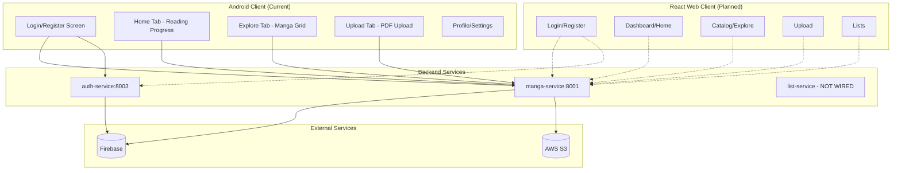
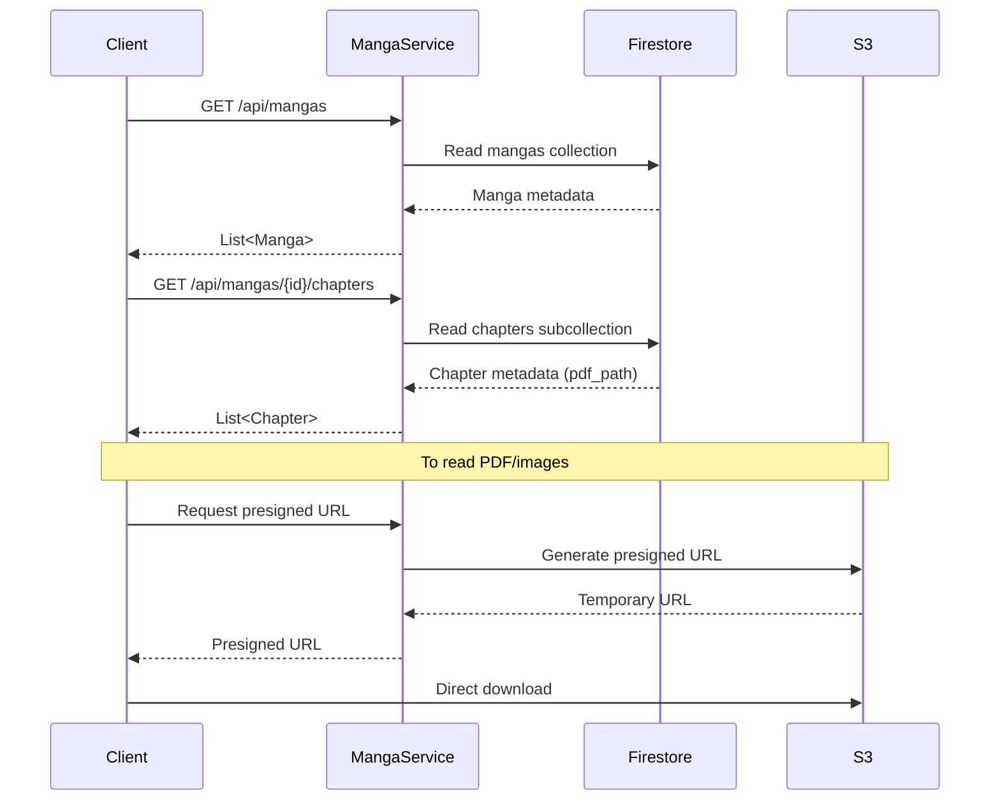
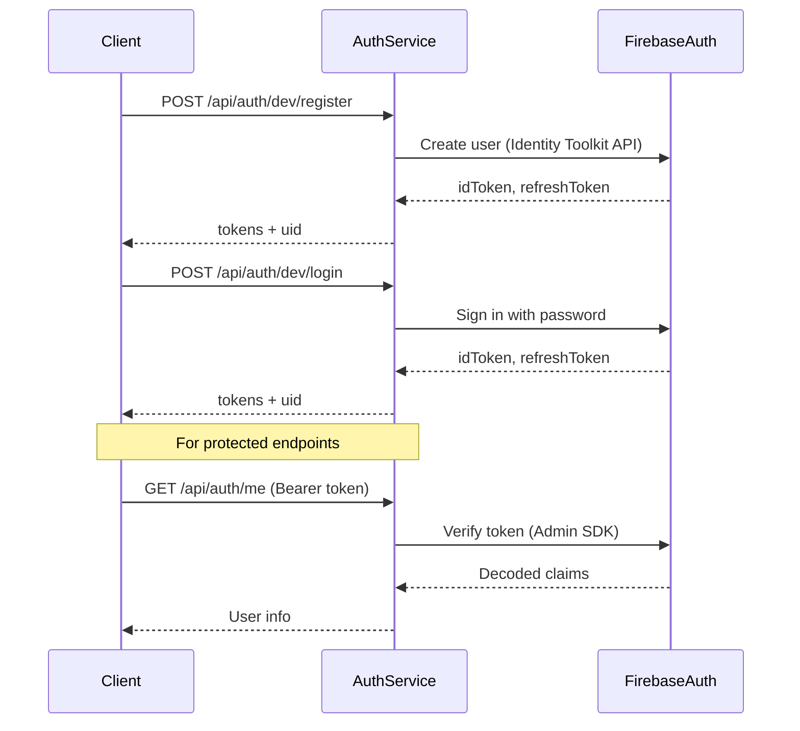
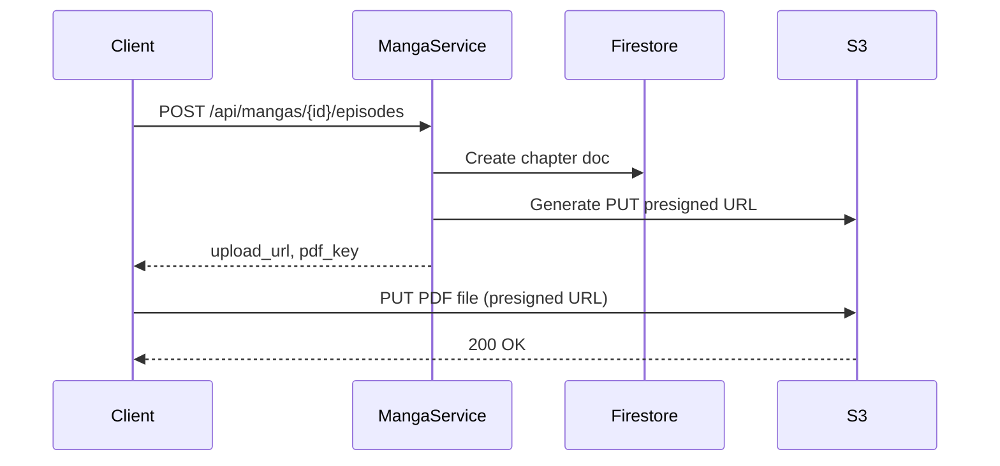

# AG_01 – Inku System Map

> **Author**: Auto-generated by Antigravity analysis  
> **Date**: 2026-01-09  
> **Version**: 1.0 – Read-only pre-migration snapshot

---

## 1. High-Level Architecture



---

## 2. Component Inventory

| Component | Type | Location | Port | Status |
|-----------|------|----------|------|--------|
| **manga-service** | FastAPI microservice | `backend/manga-service/` | Host:8001 → Container:8000 | ✅ Active |
| **auth-service** | FastAPI microservice | `backend/auth-service/` | Host:8003 → Container:8003* | ⚠️ Port mismatch in Dockerfile |
| **list-service** | FastAPI microservice | `backend/list-service/` | Not wired | 🔴 Stub only |
| **Android App** | Kotlin/Jetpack Compose | `Inku/` | N/A | ✅ Active |
| **Firebase Firestore** | External DB | N/A | N/A | ✅ Metadata storage |
| **Firebase Auth** | External Auth | N/A | N/A | ✅ User authentication |
| **AWS S3** | External Storage | `eu-north-1` | N/A | ✅ PDF/image storage |

---

## 3. Data Flow

### 3.1 Read Manga Flow


### 3.2 Authentication Flow


### 3.3 Upload Flow (Planned)


---

## 4. Firestore Data Model

```
mangas (collection)
├── {manga_id}
│   ├── title: string
│   ├── description: string
│   ├── cover_path: string (S3 key)
│   ├── recommended: string | null
│   ├── tags: array<string> | string
│   └── chapters (subcollection)
│       └── {chapter_id}
│           ├── number: int
│           ├── manga_id: string
│           ├── title: string
│           ├── pdf_path: string (S3 key)
│           └── thumb_path: string (S3 key)
```

---

## 5. AWS S3 Structure

**Bucket**: `aws-inku-bucket`  
**Region**: `eu-north-1`

```
aws-inku-bucket/
├── covers/
│   └── {manga_id}.jpg
├── chapters/
│   └── {manga_id}/
│       └── {chapter_number}.pdf
├── thumbnails/
│   └── {chapter_id}.jpg
```

---

## 6. Environment Variables (Keys Only)

### manga-service
| Variable | Description |
|----------|-------------|
| `FIREBASE_PROJECT_ID` | Firebase project ID |
| `FIREBASE_SERVICE_ACCOUNT_FILE` | Path to service account JSON |
| `AWS_REGION` | S3 region |
| `AWS_S3_BUCKET` | S3 bucket name |
| `AWS_ACCESS_KEY_ID` | AWS access key |
| `AWS_SECRET_ACCESS_KEY` | AWS secret |
| `API_PREFIX` | Default: `/api` |
| `DEBUG` | Debug mode flag |

### auth-service
| Variable | Description |
|----------|-------------|
| `FIREBASE_SERVICE_ACCOUNT_PATH` | Path to service account JSON |
| `FIREBASE_WEB_API_KEY` | Firebase Web API key |
| `API_PREFIX` | Default: `/api` |

---

## 7. CI/CD Pipelines

| Workflow | Trigger | Purpose |
|----------|---------|---------|
| `android-ci.yml` | Push/PR to main | Lint, test, build APK |
| `publish-images.yml` | Push to main (if service changes) | Build & push Docker images to GHCR |
| `run_test.yml` | Push/PR (manga-service changes) | Run Python unit tests |

**Container Registry**: `ghcr.io/juliorubiodev/inku-{service}:latest`

---

## 8. Android App Features (Migration Requirements)

| Screen | Features | Backend Integration |
|--------|----------|---------------------|
| **Login** | Email/password, Google, GitHub (TODO), Forgot password | auth-service |
| **Register** | Email/password signup | auth-service |
| **Home** | Reading progress, Trending (mock) | manga-service (future) |
| **Explore** | Manga grid with search (TODO) | manga-service |
| **Upload** | Title, description, genre pills, PDF picker (TODO) | manga-service (presign) |
| **Profile** | User info display | auth-service |
| **Settings** | Theme, preferences | Local only |

---

## 9. Known Gaps vs Requirements

| Feature | Current State | Required for Web |
|---------|--------------|------------------|
| Public user lists | ❌ list-service is stub | ✅ Must implement |
| PDF reader | ✅ Android (PDF.js equivalent) | ✅ Need web viewer |
| Favorites | ✅ Local on Android | ✅ Need backend sync |
| Reading progress | ✅ Mock data | ✅ Need backend persistence |
| Admin moderation | ❌ Not implemented | ✅ Required |
| CORS config | ❌ Not configured | ✅ Required for web |
