# Hito 4: Composición de Servicios

En este hito se ha implementado la orquestación de los microservicios del proyecto Inku mediante contenedores Docker. El objetivo es lograr un despliegue reproducible, aislado y escalable de la arquitectura backend, permitiendo levantar toda la infraestructura necesaria con un único comando mediante Docker Compose.

## 1. Arquitectura del Clúster de Contenedores

Para este proyecto, se ha diseñado una arquitectura de microservicios desacoplados que se ejecutan en contenedores independientes. Esta estructura permite escalar cada servicio por separado y mantener una separación clara de responsabilidades.

Los servicios que componen el clúster actual son:

### Auth Service: 
Encargado de la gestión de usuarios, autenticación y comunicación con Firebase Auth.

### Manga Service:
Encargado de la lógica de negocio principal, gestión de catálogos y comunicación con la base de datos Firestore y almacenamiento S3.


## Justificación de la estructura: 
La elección de separar la aplicación en contenedores distintos obedece al principio de responsabilidad única. Al aislar auth de manga, garantizamos que un fallo en la lógica de lectura no comprometa el sistema de autenticación. Además, Docker Compose nos permite definir una red interna donde estos servicios pueden comunicarse de forma segura, exponiendo al exterior únicamente los puertos necesarios.

## 2. Definición de Contenedores
Para la creación de las imágenes de los microservicios se ha optado por un enfoque homogéneo utilizando la misma imagen base para garantizar compatibilidad y facilitar el mantenimiento.

Justificación de la Imagen Base
Se ha seleccionado python:3.11-bookworm como imagen base para ambos servicios.

Python 3.11: Versión estable y moderna que ofrece mejoras significativas de rendimiento respecto a versiones anteriores.

Debian Bookworm: Al usar la variante bookworm (la versión estable actual de Debian), aseguramos un sistema operativo robusto, seguro y con acceso a las librerías de sistema necesarias para compilar dependencias de Python si fuera necesario.

Optimización: Se han configurado variables de entorno como PYTHONDONTWRITEBYTECODE=1 y PYTHONUNBUFFERED=1 para evitar la generación de archivos .pyc y asegurar que los logs de la aplicación se envíen directamente a la salida estándar del contenedor, facilitando la depuración.

### Auth Service Dockerfile
El Dockerfile del servicio de autenticación se encarga de instalar las dependencias y exponer el puerto 8003.

```Dockerfile

# ---- Base image (Debian) ----
FROM python:3.11-bookworm

# ---- Environment ----
ENV PYTHONDONTWRITEBYTECODE=1 \
    PYTHONUNBUFFERED=1

# ---- Working directory ----
WORKDIR /app

# ---- Install dependencies ----
COPY requirements.txt .
RUN pip install --upgrade pip && pip install -r requirements.txt

# ---- Copy project ----
COPY . .

# ---- Expose port ----
EXPOSE 8000

# ---- Start FastAPI ----
CMD ["python", "-m", "uvicorn", "app.main:app", "--host", "0.0.0.0", "--port", "8003"]
```

### Manga Service Dockerfile
Similar al anterior, pero configurando el PYTHONPATH para asegurar que los módulos internos del dominio (src) sean accesibles por la aplicación.

```Dockerfile

# ---- Base image (Debian) ----
FROM python:3.11-bookworm

# ---- Environment ----
ENV PYTHONDONTWRITEBYTECODE=1 \
    PYTHONUNBUFFERED=1 \
    PYTHONPATH=/app/src

# ---- Working directory ----
WORKDIR /app

# ---- Install dependencies ----
COPY requirements.txt .
RUN pip install --upgrade pip && pip install -r requirements.txt

# ---- Copy project ----
COPY . .

# ---- Expose port ----
EXPOSE 8000

# ---- Start FastAPI ----
CMD ["python", "-m", "uvicorn", "inku_api.main:app", "--app-dir", "src", "--host", "0.0.0.0", "--port", "8000"]
```


## 3. Orquestación con Docker Compose
La composición de los servicios se define en el archivo docker-compose.yml. Este archivo actúa como la "infraestructura como código", permitiendo levantar el entorno completo de forma determinista.

### Análisis del docker-compose.yml
```YAML
version: "3.9"

services:
  manga-service:
    build:
      context: ./manga-service
      dockerfile: Dockerfile
    container_name: manga-service
    env_file:
      - ./manga-service/.env
    environment:
      PYTHONPATH: /src
      FIREBASE_SERVICE_ACCOUNT_PATH: /secrets/firebase-service-account.json
    ports:
      - "8001:8000"
    restart: always

  auth-service:
    build:
      context: ./auth-service
      dockerfile: Dockerfile
    container_name: auth-service
    env_file:
      - ./auth-service/.env
    ports:
      - "8003:8000"
    restart: always
```
### Puntos clave de la configuración:

Contextos de Construcción (build context): Cada servicio apunta a su directorio específico (./manga-service, ./auth-service), asegurando que el contexto de Docker solo incluya los archivos necesarios para ese microservicio.

Mapeo de Puertos:

manga-service expone su puerto interno 8000 al 8001 del host.

auth-service expone su puerto interno 8000 al 8003 del host.

Esto permite acceder a ambos servicios simultáneamente desde localhost sin conflictos.

Gestión de Configuración (env_file): Las variables de entorno sensibles (credenciales, claves API) se inyectan mediante archivos .env, cumpliendo con las buenas prácticas de seguridad (12-Factor App) y separando la configuración del código.

Reinicio (restart: always): Garantiza que si un contenedor falla, Docker intentará levantarlo nuevamente, mejorando la resiliencia del sistema.

## 4. Automatización e Integración Continua (GitHub Packages)
Para cumplir con el requisito de distribución, se ha configurado un flujo de trabajo en GitHub Actions que construye y publica automáticamente las imágenes de Docker en GitHub Container Registry (GHCR).

### Workflow de Publicación
El archivo publish-images.yml implementa una estrategia inteligente:

Detección de Cambios: Utiliza dorny/paths-filter para detectar qué microservicio ha sido modificado.

Construcción Selectiva: Solo reconstruye y publica la imagen del servicio que ha sufrido cambios, optimizando tiempos de CI/CD.

Ejecución exitosa del Workflow:

### Pruebas:

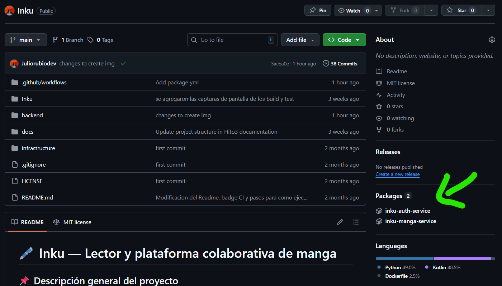

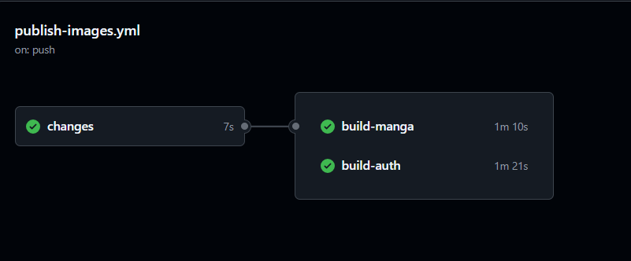

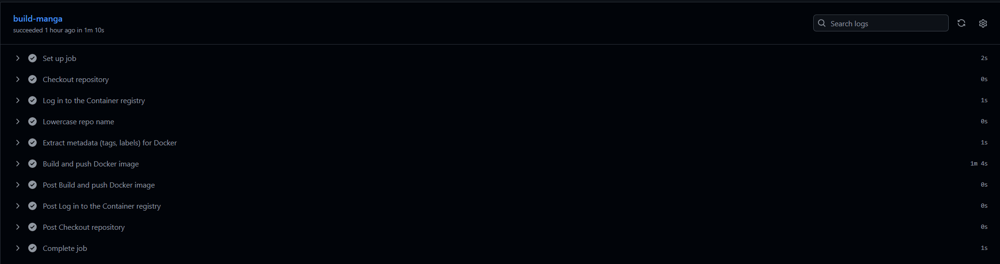

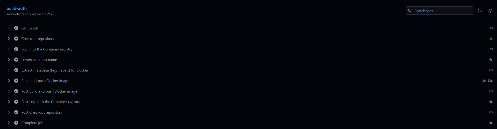
## 5. Despliegue y Pruebas
Para validar el funcionamiento del clúster, se ejecutan los siguientes pasos:

### Construcción y arranque:

Bash

docker-compose up --build -d

Verificación de estado: Comprobamos que los contenedores están corriendo correctamente.

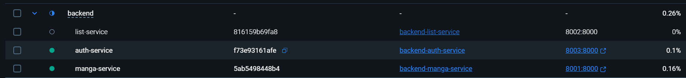


### Validación de Endpoints
Se han realizado pruebas funcionales contra los servicios desplegados en los puertos locales (8001 y 8003) utilizando un cliente HTTP.

#### 1. Registro de Usuario (Auth Service - Puerto 8003): Se verifica la creación de un nuevo usuario, obteniendo el token de identidad.

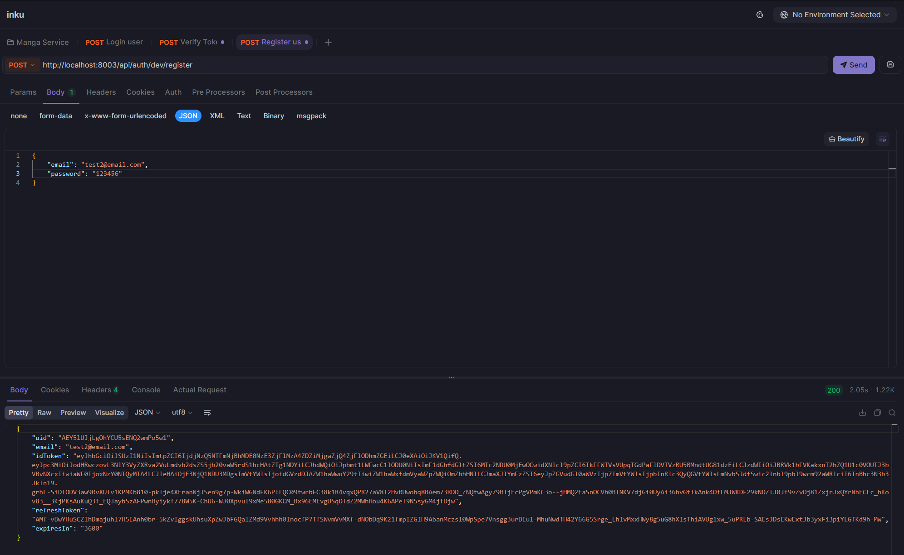

#### 2. Login de Usuario (Auth Service - Puerto 8003): Verificación de credenciales y obtención de tokens.

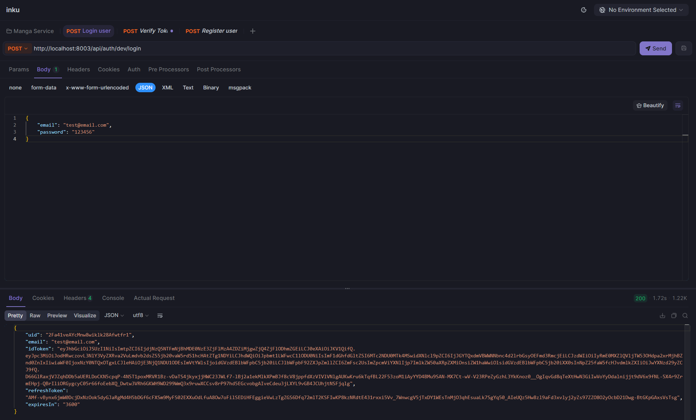

#### 3. Verificación de Token (Auth Service - Puerto 8003): Validación de que el token JWT es correcto y decodificación de los claims.

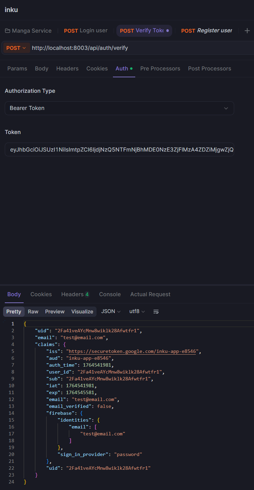

#### 4. Obtención de Mangas (Manga Service - Puerto 8001): Petición al servicio de mangas que retorna la lista disponible.

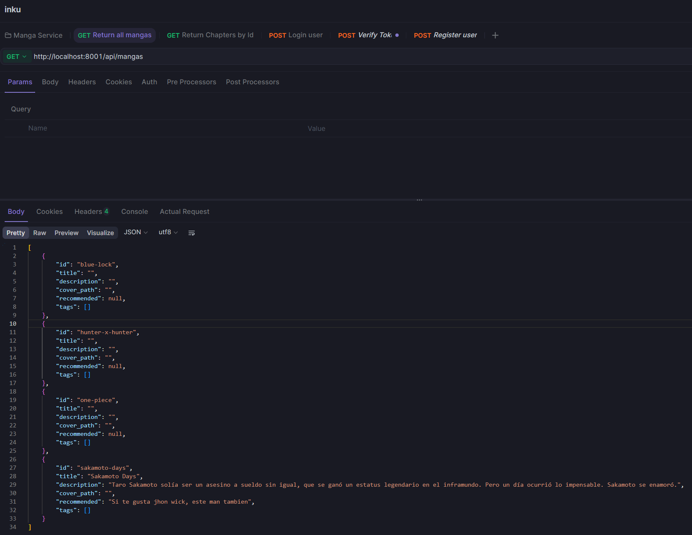

#### 5. Obtención de Capítulos (Manga Service - Puerto 8001): Recuperación de los capítulos específicos de un manga por su ID.

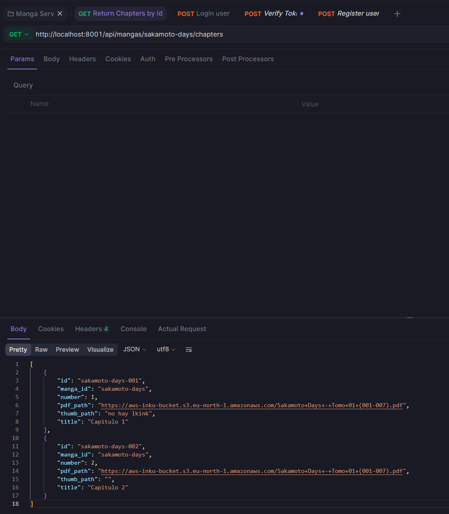

#### Estructura de Peticiones

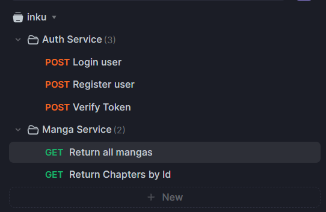

#### Logs:

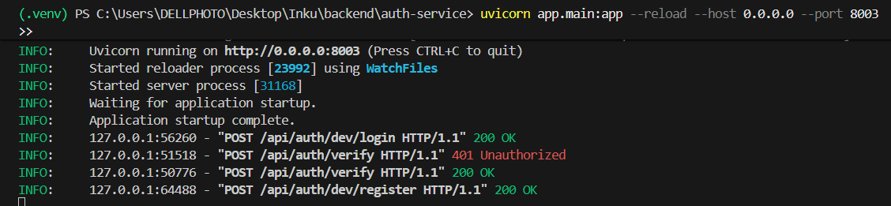

#### Test:

Se añaden 5 test nuevos y mas reforzados, que prueban todos las peticiones de el servicio.

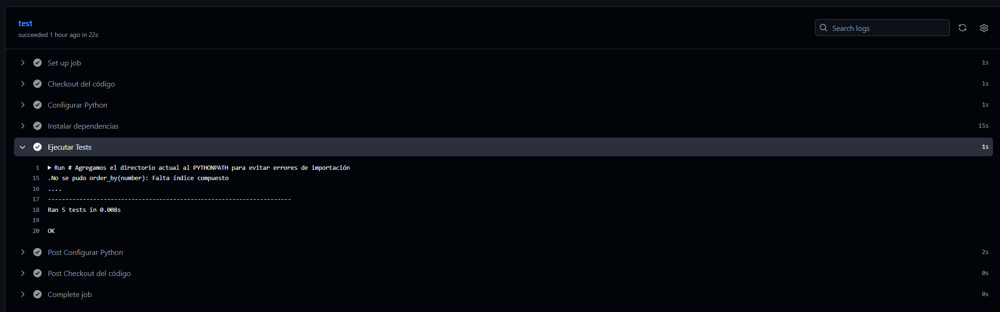

